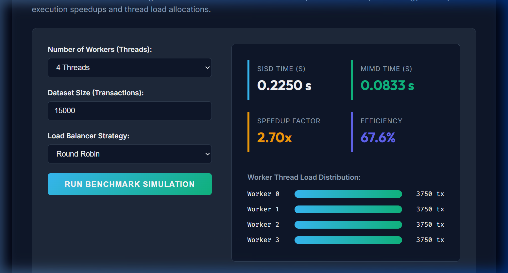

# Parallel Job Scheduler

## Overview

Parallel Job Scheduler adalah aplikasi berbasis web dan CLI yang dikembangkan untuk mengimplementasikan dan menganalisis konsep Komputasi Paralel pada penjadwalan pemrosesan data log transaksi retail.

Aplikasi ini membandingkan dua metode pemrosesan data:

* Sequential Processing (SISD - Single Instruction Single Data)
* Parallel Processing (MIMD - Multiple Instruction Multiple Data)

Sistem dibangun menggunakan murni Python 3 dengan modul standard library `threading` untuk backend pemrosesan data, serta Vanilla HTML5, Vanilla CSS3, dan Vanilla JavaScript untuk antarmuka simulator web interaktif.

---

## Background

Pemrosesan log transaksi retail berskala besar (seperti `OnlineRetail.csv`) membutuhkan komputasi agregasi yang intensif untuk menghasilkan metrik total pendapatan, kuantitas barang, dan klasifikasi produk terlaris. Pada sistem sekuensial (single-threaded), pemrosesan ini berjalan lambat karena hanya memanfaatkan satu core processor saja.

Untuk mengatasi bottleneck tersebut, diperlukan pendekatan komputasi paralel menggunakan pembagian kerja (load balancing) ke beberapa thread worker agar proses parsing data dapat berjalan secara konkuren, efisien, dan memanfaatkan seluruh core processor modern secara optimal.

---

## Objectives

Tujuan utama project ini adalah:

* Mengimplementasikan konsep komputasi paralel menggunakan Threading pada Python tanpa dependensi eksternal.
* Membandingkan performa antara Sequential Processing (SISD) dan Parallel Processing (MIMD).
* Mengukur execution time, speedup, efisiensi (efficiency), dan load balance deviation.
* Menganalisis perbedaan performa 3 strategi pembagian beban kerja (*Equal*, *Round Robin*, dan *Weighted*).
* Menjamin keaslian data output antara pemrosesan paralel dan sekuensial melalui sistem verifikasi otomatis.
* Menyediakan simulator web interaktif yang memvisualisasikan load balancing antar thread secara real-time.

---

## Dashboard Preview

Berikut merupakan tampilan utama aplikasi Parallel Job Scheduler.

Fitur utama yang tersedia pada dashboard:

* Pengaturan jumlah thread worker
* Pengaturan ukuran dataset transaksi (Load volume)
* Pemilihan strategi Load Balancer (*Equal Chunks*, *Round Robin*, atau *Weighted*)
* Analisis performa real-time (Speedup dan Efficiency)
* Visualisasi distribusi beban kerja masing-masing thread worker secara dinamis

---

## Features

### Command Line Interface (CLI)

Aplikasi dapat dijalankan melalui terminal dengan berbagai opsi parameter konfigurasi.

Opsi Command Line Arguments yang didukung:
* `--workers` / `-w`: Menentukan jumlah worker thread paralel (default: 4).
* `--strategy` / `-s`: Memilih metode load balancing (`equal`, `round_robin`, atau `weighted`).
* `--weights` / `-wt`: Memberikan rasio kapasitas kerja untuk strategi weighted (misalnya: `4,2,1,1`).
* `--dataset` / `-d`: Menentukan lokasi file dataset log (default: `OnlineRetail.csv`).

### Load Balancing Strategies

Sistem mengimplementasikan tiga metode distribusi beban data:

* **Equal Chunks**: Membagi baris transaksi secara merata menjadi potongan-potongan berurutan.
* **Round Robin**: Mendistribusikan baris transaksi secara bergantian satu per satu ke setiap thread secara melingkar (cyclical).
* **Weighted Distribution**: Mendistribusikan porsi beban kerja sesuai rasio bobot spesifik yang diberikan kepada masing-masing thread.

### Verification Guarantee

Setelah pemrosesan selesai, sistem otomatis melakukan deep comparison antara hasil SISD dan MIMD untuk memastikan data total revenue, quantity, country revenue, dan top 10 products memiliki kecocokan 100% tanpa adanya race condition.

---

## Technologies Used

### Backend Engine
* Python 3 (standard libraries: `threading`, `json`, `argparse`, `time`, `datetime`)

### Frontend Web (GitHub Pages)
* HTML5 (Structure & Semantics)
* CSS3 (Styling & Theme Variables)
* JavaScript (Interactive Simulator & CSS Animations)
* Google Fonts (Typography: Inter, Outfit, Fira Code)
